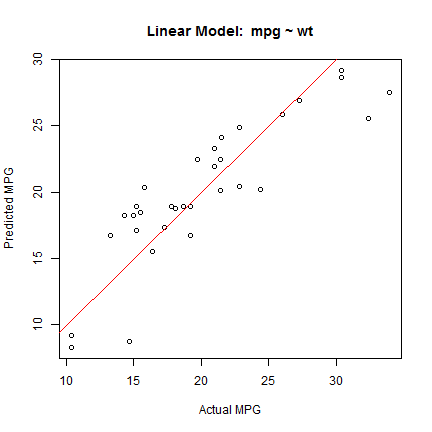
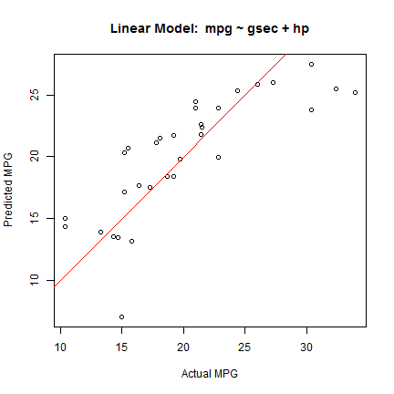

## Estimating Automobile Mileage: Exploring model fit using a Shiny App

* The Shiny app allows you to explore the effect of including/excluding various variables from a linear model (without interaction) to see how this effects model fit. 

* Automobile mileage can be estimated as a linear effect of weight, 1/4 mile time, and Horsepower.

* App URL: https://anielsen108.shinyapps.io/ddp_app/

---

## Design of the Shiny App


```r
# ui.R includes Checkbox Group Input to allow the user to select variables
checkboxGroupInput("variables", "Variables to Include",
                          c("Weight" = "wt",
                            "1/4 mile time" = "qsec",
                            "Horsepower" = "hp")),

# server.R stores these in array
variables <- eventReactive(input$fitButton, {input$variables})

# A formula for a linear model is built based on the variables checked.
formulaString <- "mpg ~"
if ("wt" %in% variables()) formulaString <- paste(formulaString, " wt +")
if ("qsec" %in% variables()) formulaString <- paste(formulaString, " qsec +")
if ("hp" %in% variables()) formulaString <- paste(formulaString, " hp +")
formulaString <- paste(formulaString, " 1 ")
           
fit <- lm(as.formula(formulaString), mtcars)
```

---

## Example 1: mpg predicted by weight



---

## Example 2: mpg predicted by quarter mile time and horsepower


---

## Conclusions: inclusion/exclusion matters

* As can be seen from these examples, the app allows the user to visually explore model fit for mileage estimation when including/excluding variables.

* Visually inspecting the fit is a good method to quickly see if there are any gross modelling errors.

* Check it out now! App URL: https://anielsen108.shinyapps.io/ddp_app/

